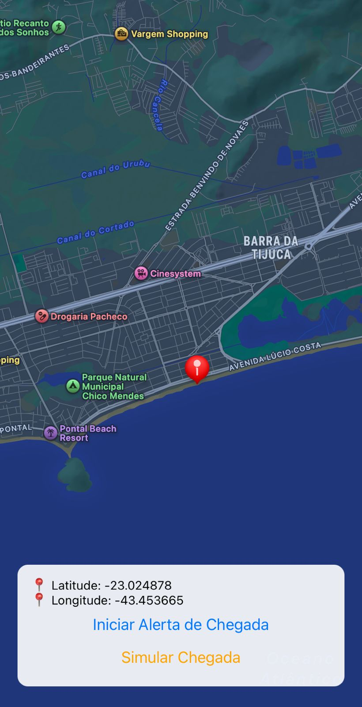

# 🚨 Zegen

<p align="center">
  
</p>

**Zegen** is an open-source mobile application built with **Expo (React Native)** designed to ensure you **never miss your stop again**.
It allows users to **select a destination directly on the map** and automatically **triggers a high-priority alarm notification** when they are approaching that location — ideal for commuters who might fall asleep on buses, trains, or subways.

> Think of Zegen as your **personal geolocation wake-up assistant**.

---

## 📸 Screenshots

<p align="center">
  
</p>

---

## ✨ Key Features

* 🗺️ **Interactive Map Selection**
  Choose any point on the map as your destination with precision.

* 📍 **Geofencing-Based Alerts**
  Zegen continuously monitors your position and detects when you are near the selected destination — even while running in the background.

* 🔔 **High-Priority Wake-Up Alarm**
  A loud alarm sound combined with a maximum-priority notification ensures you won’t miss it.

* 📱 **Background Execution**
  Works reliably even when the app is minimized or closed.

* 💤 **Built for Commuters**
  Perfect for daily travel, naps on public transport, or long commutes.

* 🌗 **Automatic Light / Dark Theme**
  Seamlessly adapts to the system appearance.

* 🧭 **Accurate GPS Tracking**
  Uses native device location services for better accuracy and reliability.

---

## 🧩 Technologies Used

* [React Native](https://reactnative.dev/)
* [Expo SDK](https://docs.expo.dev/)
* [expo-location](https://docs.expo.dev/versions/latest/sdk/location/)
* [expo-notifications](https://docs.expo.dev/versions/latest/sdk/notifications/)
* [expo-task-manager](https://docs.expo.dev/versions/latest/sdk/task-manager/)
* [react-native-maps](https://github.com/react-native-maps/react-native-maps)

---

## 🏗️ Project Structure

```
zegen/
├── app/
│   ├── index.tsx            # Main screen (map + alarm logic)
│   ├── _layout.tsx          # Root layout
│   └── ...
├── assets/
│   ├── alarm.mp3            # Alarm sound
│   ├── images/
│   │   ├── icon.png         # App icon
│   │   ├── splash-icon.png  # Splash screen logo
│   │   └── ...
├── app.json                 # Expo configuration (permissions, plugins, etc.)
├── package.json
└── README.md
```

---

## ⚙️ Setup & Installation

### Prerequisites

Ensure the following tools are installed:

* **Node.js** ≥ 18
* **Expo CLI** (`npm install -g expo-cli`)
* **Android Studio** (for emulator and builds)
* **Google Maps API Key** (required for Android)

---

### 1. Clone the Repository

```bash
git clone https://github.com/apozinn/zegen.git
cd zegen
```

---

### 2. Install Dependencies

```bash
npm install
```

or

```bash
yarn install
```

---

### 3. Configure Google Maps API Key (Android)

Open:

```
android/app/src/main/AndroidManifest.xml
```

Add:

```xml
<meta-data
  android:name="com.google.android.geo.API_KEY"
  android:value="YOUR_API_KEY_HERE" />
```

You can generate a key from the [Google Cloud Console](https://console.cloud.google.com/).

---

### 4. Run the App

```bash
npx expo start
```

Available options:

* **`a`** → Android Emulator
* **`w`** → Web browser
* **`s`** → Scan QR code with Expo Go (physical device)

---

### 5. Production Build

#### Android

```bash
npx expo prebuild
npx expo build:android
```

Generates an `.apk` or `.aab` ready for **Google Play Store**.

#### iOS

```bash
npx expo build:ios
```

> Requires an Apple Developer account.

---

## 🧪 Development & Testing

To test alarm behavior without moving physically, you can simulate arrival:

```ts
import * as Notifications from 'expo-notifications';

export async function simulateArrival() {
  await Notifications.scheduleNotificationAsync({
    content: {
      title: '🚨 Simulated Arrival!',
      body: 'You have reached your selected destination (simulation).',
      sound: 'alarm.mp3',
      priority: Notifications.AndroidNotificationPriority.MAX,
    },
    trigger: null,
  });
}
```

Call `simulateArrival()` anywhere during development to instantly test notifications.

---

## 🤝 Contributing

Contributions are very welcome!

You can help by improving:

* UI / UX
* Alarm customization (volume, vibration patterns, sounds)
* Offline behavior & fallbacks
* Localization (multi-language support)
* Performance & battery optimization

Fork the repository and open a pull request 🚀

---

## 📄 License

This project is licensed under the **GNU Lesser General Public License (LGPL)**.
See the [LICENSE](./LICENSE) file for more information.

---

## 🌍 Support & Feedback

If you find Zegen useful, consider giving it a ⭐ on GitHub.
Found a bug or have a feature idea? Open an issue!

---

**Zegen** — *Never miss your destination again.*
